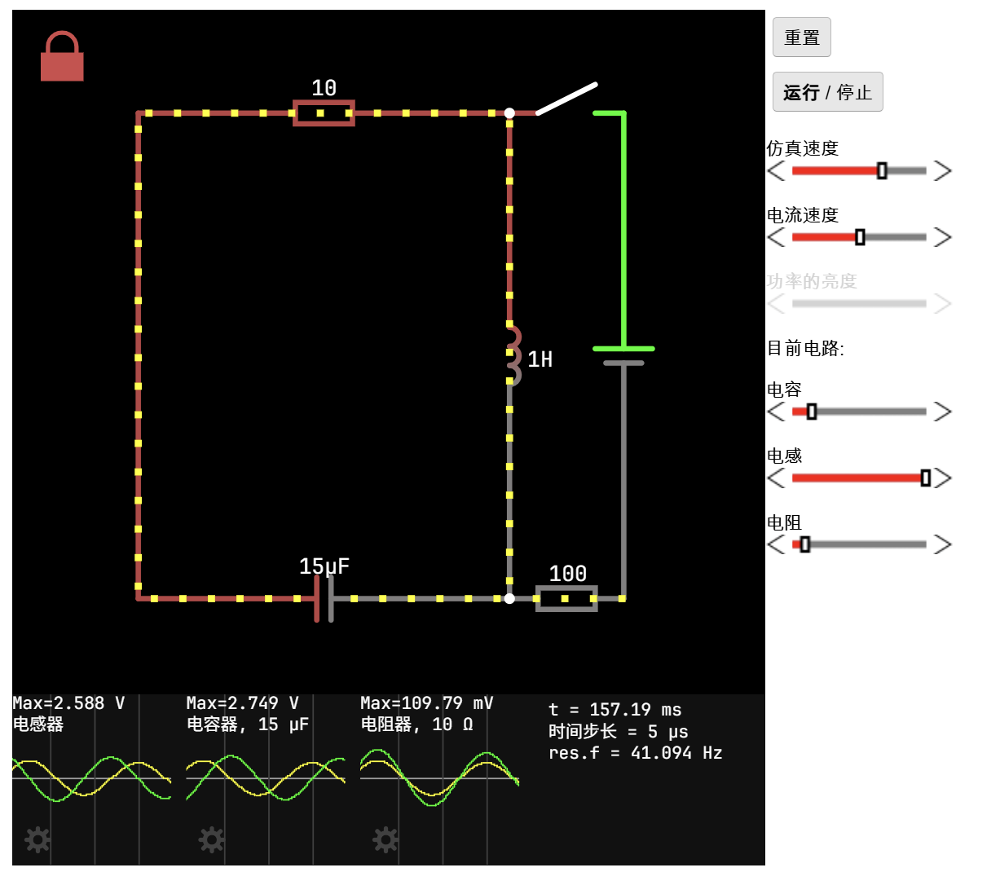
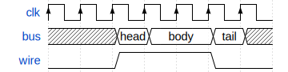

# Electronic Documentation Template
[English] | [简体中文](README.zh-CN.md)

[](https://github.com/sphinx-doc/sphinx)
[](LICENSE)
[](LICENSE.docs)

[](https://github.com/swcxito/electronic-docs-template)

A Sphinx documentation template specifically designed for electronic circuit documentation, featuring integrated circuit simulation and timing diagram capabilities.

## Features

- **📚 Sphinx Documentation**: Built on the powerful Sphinx documentation generator
- **⚡ Circuit Demonstration and Simulation**: Integrated CircuitJS simulator for interactive circuit demonstrations



- **📊 Timing Diagrams**: WaveDrom support for beautiful timing diagrams and waveforms



- **🚀 Automatic Deployment to GitHub Pages**: Supports automatic building and deployment of documentation to GitHub Pages via GitHub Actions.

  - See example page: [https://swcxito.github.io/electronic-docs-template/](https://swcxito.github.io/electronic-docs-template/)

## Quick Start

### Create your repository
1. Click Use this template
2. Git clone your new repo
3. Enter the repo folder

If you are using this repo, putting the following badge on your README is appreciated:

[](https://github.com/swcxito/electronic-docs-template)
``` md
[](https://github.com/swcxito/electronic-docs-template)
```


### Build the documentation
#### Using [](https://github.com/astral-sh/uv) (Recommended)
1. Install required dependencies(first-time only):
```bash
uv sync
```

2. Build the documentation:
```bash
# On Linux
uv run make html
```
#### Using pip (Using venv is Recommended)
1. Install required dependencies(first-time only):
```bash
pip install -r requirements.txt
```

2. Build the documentation:
```bash
# On Linux
make html
```

> **If you want to build the documentation on Windows, build it through [WSL](https://learn.microsoft.com/en-us/windows/wsl/install).**

### Open the generated documentation:
> Due to the security policy of modern browsers, some features (like CircuitJS simulation) may not work properly when opening the HTML files directly. It's recommended to use a local web server to serve the files.
1. Start a simple HTTP server:
```bash
# Run server
python -m http.server --directory build/html 8080
```
2. Open your browser and navigate to `http://localhost:8080`

## Usage

### Writing Documentation

This template supports both reStructuredText and Markdown formats:

- **reStructuredText**: Use `.rst` files for full Sphinx feature support
- **Markdown**: Use `.md` files for simpler syntax (via MyST parser)

You can access Sphinx for more details: [](https://www.sphinx-doc.org/)

### Circuit Simulation
#### Get Circuit Data:

1. Open [CircuitJS1](https://www.falstad.com/circuit/circuitjs.html)
2. Create or load a circuit
3. Click "File" -> "Export to URL" and copy the generated url
4. Extract the circuit data from the URL (the part after `ctz=`)

#### Use the custom `circuit` directive to embed interactive CircuitJS simulations:

```rst
.. circuit:: your-circuit-data-here
   :height: 640
   :width: 100%
   :running: true
   :editable: false
```

**Available Options:**

- `height`: iframe height (default: 640)
- `width`: iframe width (default: 100%)
- `running`: start simulation automatically (default: true)
- `hide-menu`: hide the top menu (default: true)
- `hide-sidebar`: hide the right sidebar (default: false)
- `editable`: allow circuit editing (default: false)
- `hide-infobox`: hide component info box (default: false)
- `mousewheel-edit`: enable mouse wheel parameter editing (default: true)


### Timing Diagrams

Create timing diagrams using WaveDrom syntax:

```rst
.. wavedrom::

   { "signal": [
     { "name": "clk",  "wave": "P......" },
     { "name": "bus",  "wave": "x.==.=x", "data": ["head", "body", "tail"] },
     { "name": "wire", "wave": "0.1..0." }
   ]}
```

access WaveDrom for more details: [](https://wavedrom.com/tutorial.html)

## Configuration

The main configuration is in `conf.py`. Key settings include:

- **Project Information**: Update `project`, `author`, and `copyright`
- **Extensions**: Add or remove Sphinx extensions
- **Theme**: Customize the HTML theme and appearance


## Contributing

1. Fork the repository
2. Create a feature branch
3. Make your changes
4. Test the documentation builds correctly
5. Submit a pull request

## 📜 License

### Project License
This project, **electronic-docs-template**, is licensed under the **GNU General Public License, Version 2 (GPLv2)**.  
See the [LICENSE](./LICENSE) file for full terms.

© 2025 swcxito.
You are free to use, modify, and redistribute this template under the terms of GPLv2.

---

### Included Components

This project integrates or automates the use of several open-source components:

| Component| Source| License|
|-|-|-|
| **Sphinx**          | [](https://github.com/sphinx-doc/sphinx)| |
| **sphinx-wavedrom** | [](https://github.com/bavovanachte/sphinx-wavedrom)| |
| **CircuitJS1**      | [](https://github.com/pfalstad/circuitjs1)| |


---

### Documentation License

Note: The documentation content in this repository is licensed under the **MIT License**. See [LICENSE.docs](./LICENSE.docs) for full terms.

Although this template itself is licensed under **GPLv2**,
any **documentation content** (e.g., `.rst` or `.md` files created using this template)
may be released by its authors under **a different license** — for example:

- [Creative Commons Attribution 4.0 International (CC BY 4.0)](https://creativecommons.org/licenses/by/4.0/)
- [Creative Commons Attribution-ShareAlike 4.0 (CC BY-SA 4.0)](https://creativecommons.org/licenses/by-sa/4.0/)
- [Creative Commons Attribution-NonCommercial 4.0 (CC BY-NC 4.0)](https://creativecommons.org/licenses/by-nc/4.0/)
- or any other license chosen by the author.

Users creating new documentation with this template **retain full copyright** over their written content.

## Version History

- **v0.1** (2025): Initial template release
  - Basic Sphinx setup
  - CircuitJS integration
  - WaveDrom support
  - RTD theme configuration

---

**Author**: swcxito
**Version**: 0.1
**Last Updated**: 2025
